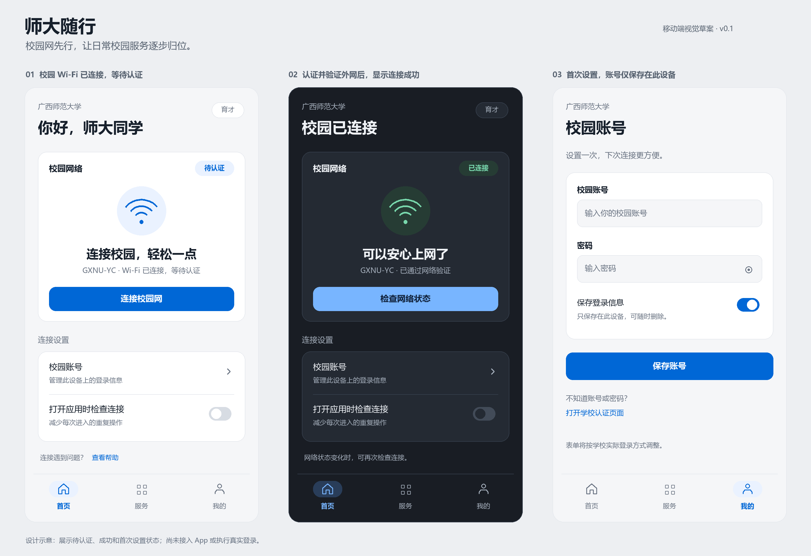
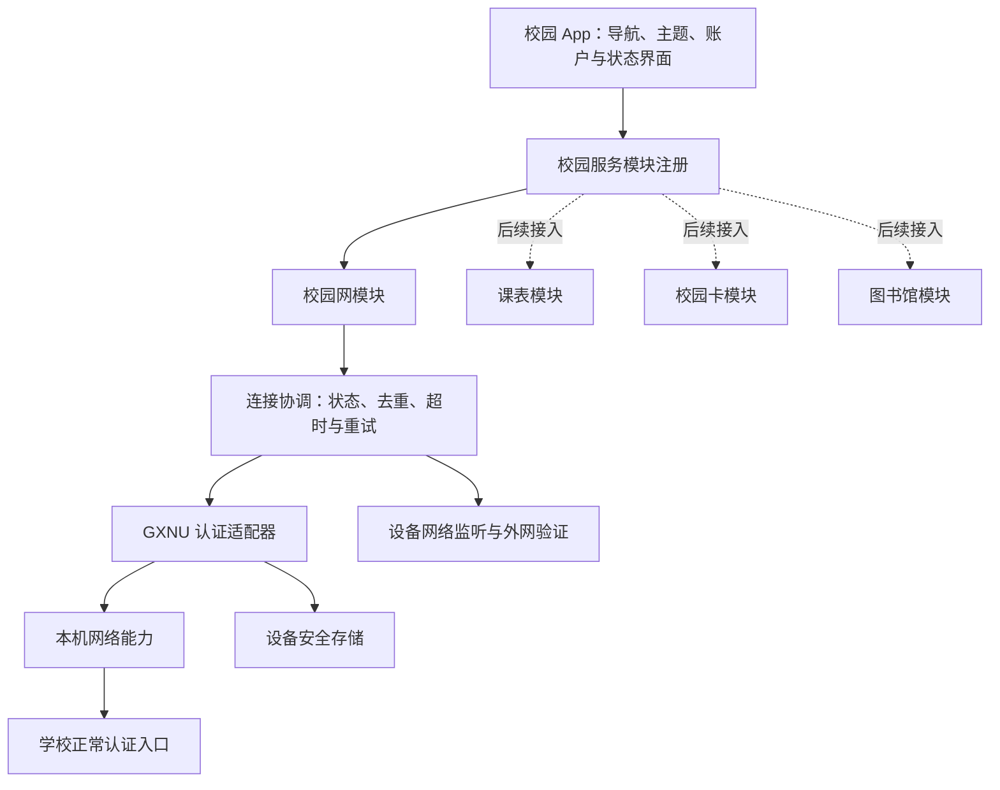

# 广西师范大学校园 App 设计与扩展路线

工作名称：师大随行。首期让校园 Wi-Fi 认证变成一个清楚、快速的操作；后续校园功能沿同一套界面和模块接口加入。名称可在品牌设计时调整。

本稿依据 2026-10-06 的调查与用户答复编写。首发 Android，Windows 第二，iPhone 最后；使用独立校园网账号页面保存信息，首页选择供应商，下次自动连接。Android 采用 Kotlin + Jetpack Compose，已进入实现与验收。本机已有可运行的 App 和模拟器；实体手机的校园认证仍需实测。

图中是早期静态草案，展示待认证、认证并验证外网成功、首次设置三种状态。产品当前界面见下面的排版说明和实际模拟器截图；该图不是 App 截图。

## 首期使用体验

首次进入时先说明校园网络的作用，再设置必要账户。账户字段按学校真实认证流程显示，不把技术参数交给用户填写。若用户选择保存账户，凭据只保存到设备的安全存储。

常用首页在首屏展示学校、校园网状态和一个主按钮。连接到校园 Wi-Fi 但尚未认证时，显示“校园 Wi-Fi 已连接 · 等待认证”和“连接校园网”；认证中改为“正在验证账户”，完成后还要检查外网，再显示“已连接，可以上网”。按钮文案随状态改变，连续点击不会重复提交。

没有 Wi-Fi 时引导进入系统 Wi-Fi 设置；在其他 Wi-Fi 或移动数据下不会擅自发送校园账户。学校接口返回错误时给出可操作的原因，例如检查账户、等待后重试或打开学校原页面。已认证但外网仍不可用时，显示“认证完成，网络仍需检查”，不显示虚假的成功状态。

首次设置后，不再反复填写账户。Android 应用打开时检查校园 Wi-Fi；开启自动连接后，通过带持续通知的常驻服务监听网络变化并认证。强制停止、重启或权限撤销后，重新打开 App 恢复服务。供应商保留上一次选择，第一次未选择时不擅自猜测。

## 页面与导航

移动端保留三个稳定入口：“首页”“服务”“我的”。首页集中处理校园网；服务页收纳已经接入的学校功能；我的页面管理账户、自动连接策略、主题和诊断。桌面版如被选为首发，则把这三个入口转换为侧栏，并增加适合常驻工具的状态入口。

首页从上到下是简短问候与学校名称、网络主卡、账户摘要、必要的连接设置。网络主卡包含状态标识、主操作和一行反馈；协议参数、MAC 地址和内部返回码放在诊断详情中。没有真实数据时不编造网速、流量、余额或课程信息。

账户页的输入框有固定标签、密码显示切换和字段旁错误说明。修改账户后立即停止使用旧凭据；删除账户时同时移除本地密码和相关自动认证配置。

服务页首期只有可用的校园网入口和简短的后续规划说明。未接入服务不显示成可点击的完整功能。以后增加课表、校园卡或图书馆时，只注册对应模块，不改写网络认证核心。

## 视觉方向

当前版本采用奶白背景、白色内容面和少量紫色、薄荷点缀。首页使用普通网络卡，供应商选择和连接按钮位于卡内，账号与自动连接合并为设置分组。状态有文字与图形共同表达；去掉重复标题、宣传句、轨道插画、多层色块和浮动导航。浅色为初始主题，具体规则见[排版调整](design/ui-v3-notes.md)。

浅色与可选的柔和蓝灰深色共用语义色角色；按钮、开关和选中状态使用紫色。字体统一使用 Android 系统 SansSerif：正文 400、重点最多 500，中英文与网络名共用同一套样式。字形由本机字体回退，核心界面离线可用。第二版字体移至文档留档，来源、OFL 1.1 许可、生成脚本和校验值见[字体记录](design/fonts/README.md)。

间距按 4/8 的倍数组织；移动端主要触控区域至少 48 dp，正文 15–16 sp，辅助文字 13 sp。主要状态与连接按钮在普通手机首屏可见，同时适配大字体、键盘、安全区域与横向窄屏。按钮与开关使用原生反馈并尊重系统动画设置。

已查看 Mobbin 移动页面、中文服务案例，并通过真实 Chrome 读取 Uiverse 指定组件的结构和 CSS。原生 Compose 实现采用其层次与交互思路；参考不能替代学校协议或真实业务数据。

| 参考案例 | 实际观察 | 本产品采用的设计方法 |
| --- | --- | --- |
| [Brilliant 首页](https://mobbin.com/explore/screens/05b3f5f2-735b-4e16-b052-3c2cd900d975) | 白色背景、For you 标题、Start practice 主卡和单个主按钮、Jump back in 次要卡、固定底部导航 | 将网络状态和连接动作放在首页主卡，账户与辅助入口放在后面；[现场截图](design/references/mobbin-brilliant.png) |
| [Ultrahuman 状态首页](https://mobbin.com/explore/screens/36e5a755-9c0d-4afb-ba4e-dff42cd39a47) | 深色背景、Today 标题、纵向卡片显示 Locked、No data、Calibrating，并解释原因 | 待认证、连接中、成功及失败都带明确说明，建立同等清楚的深色界面；[现场截图](design/references/mobbin-ultrahuman.png) |
| [支付宝官方展示](https://apps.apple.com/cn/app/id333206289) | 长辈模式展示中有中文图标标签、四个常用操作、3×3 服务网格和更多入口；另有问候与说明卡 | 后续校园服务用一致的网格与中文名称扩展；[服务展示](design/references/alipay-services.webp)、[首页展示](design/references/alipay-home.webp) |
| [Swiggy Mobbin 页面](https://mobbin.com/explore/screens/2701660c-de0a-4fe9-a1fb-88f97be59df6) | 只确认页面标题、描述和底部导航等标签，图片加载失败 | 仅作为服务聚合背景资料，不据此声称看过具体布局 |
| [Uiverse Creatlydev 卡片](https://uiverse.io/Creatlydev/dull-moose-30) | 实际读取白色外卡、浅色 hero 区和 footer 的 Shadow DOM/CSS；自适应 footer 排列 | 网络主卡采用浅色内层和清楚的操作区，按本产品主题重写为 Compose |
| [Uiverse Galahhad 开关](https://uiverse.io/Galahhad/strong-squid-82) | 实际读取圆形滑块、层叠圆环及位置/颜色过渡的 Shadow DOM/CSS，页面注明 MIT | 采用圆形滑块与短过渡；自动连接保持开关语义，不套用日夜图案 |

Ultrahuman 页面描述中的分数与实际截图不一致，本稿以实际看到的无数据和校准状态为准。Mobbin 的保存/复制等功能需要注册，本次只使用公开可见页面。Uiverse 本轮观察基于实际组件结构与源码，浏览器截图未成功保存。雾紫蓝是产品设计选择，不宣称是学校品牌色。

## 学校协议调查

当前电脑连接的 SSID 是 `GXNU-YC`。`https://yc.gxnu.edu.cn/` 显示已登录，明确提示“120 分钟不上网需重新登录”。该提示来自学校页面，不代表 App 应每 120 分钟强制重新提交账户。

已核对公开 `a40.js`、`a41.js` 和[真实登录模板 pc.js](https://yc.gxnu.edu.cn:802/eportal/extern/cv4FMK1700017533/lVUlj81700017559/pc.js)。当前生效模式是 ePortal `login_method=1`，请求发往 `https://yc.gxnu.edu.cn:802/eportal/portal/login`，账号由 Android 终端前缀 `,1,`、用户账号及供应商后缀组成。当前不对密码做 MD5/Base64，只按 URL 编码传入；配置接口的网络地址 Base64 与登录密码的编码规则不同。

学校实际选项为校园网（空后缀）、中国电信（`@ctc`）、中国联通（`@cuc`）、中国移动（`@cmc`）、广电网络（`@gd`）。传统 `/drcom/login` 函数仍在共享脚本中，但后续赋值改变了分派，不能取第一个函数当成现网协议。接口 `result=1` 或 `ok` 只代表认证返回成功，仍要检查目标 Wi-Fi 的真实外网。

ePortal 配置和模板使用 HTTPS 802 端口；读取这类跨端口资源时，普通网页 fetch 存在 CORS 限制。真实 App 的认证请求应通过本机原生网络模块执行，不依赖远程网页跨域请求。

研究没有主动填写账号密码、点击登录或注销当前连接。已从未认证模板确认账号、密码和供应商选择；模板没有验证码输入，但共享脚本支持其他验证码配置，遇到时需转学校原页。客户端不依据其他学校的通用 Dr.COM 示例拼接当前请求。

## 软件结构

应用外壳负责主题、导航、偏好和公共反馈。校园网模块负责网络识别、账户设置、连接状态和诊断。学校适配器负责认证页发现、参数构造和响应解析；系统桥负责网络事件和安全存储。模块之间使用明确的结果类型和能力接口，避免在页面按钮中直接拼接认证请求。

状态流建议为：未连接 Wi-Fi → 校园网络待认证 → 认证中 → 验证外网 → 在线。任何阶段都可以进入学校接口不可达、账户失败或需要用户操作的状态。切换网络或退出当前连接过程时，取消旧请求，并防止旧结果覆盖新状态。

认证与联网检测必须使用同一目标网络。Android 上若 Wi-Fi 尚未验证，系统可能仍把移动数据当成默认网络；请求需要绑定校园 Wi-Fi，否则会出现“手机可以上网，但校园网没有认证”的错误判断。

日志仅记录时间、状态类别和处理建议，不保存密码、完整请求 URL、完整账户或认证响应中的敏感内容。诊断导出必须脱敏。首期无需云端账户系统，也无需把校园密码发送给自建服务器。

## 实现路线比较

| 首发路线 | 适用目标 | 可以实现的主要结果 | 当前约束 |
| --- | --- | --- | --- |
| Android 原生 Kotlin + Jetpack Compose | 首先在 Android 手机使用 | APK、原生网络监听、安全存储、快捷入口与完整移动界面 | 本机已有 JDK/Android SDK；后台策略仍需按 Android 版本明确验证 |
| Windows Rust/Tauri + 本地界面 | 首先解决电脑认证 | 桌面状态窗口、托盘、Wi-Fi 事件与启动策略 | 本机有 Rust 和 Node；移动版将另行建设系统桥 |
| 移动跨平台框架 + 各平台原生适配器 | 确认 Android/iPhone 都是近期交付目标 | 共享多数页面和业务状态，再单独接网络与安全存储 | 本机没有 Flutter；iOS 实机编译需要 macOS/Xcode 或外部构建环境；系统自动认证能力不能由共享 UI 保证 |

已选择 Android 原生路线，先把设备网络绑定、安全存储和自动认证做通。Windows 第二、iPhone 第三，届时复用服务接口、协议规格和设计体系，按各系统实现网络能力。纯网页适合展示原型，无法单独完成本需求的自动认证。

## 后续校园功能路线

第一阶段交付校园网：账户、快速登录、真实状态、诊断、主题与模块基础。

第二阶段根据实际需求优先加入课表和校历，先明确学校数据来源、登录方式与离线规则；没有学校接口时可以考虑用户主动导入，不把未确认 API 写成已可用功能。

第三阶段加入校园卡、图书馆或常用办事入口，各自建立独立适配器和账户权限。教务身份、校园网身份与消费账户不能默认共用密码。

第四阶段再考虑统一搜索、通知和更多校园服务。每个模块独立显示可用状态、失败提示和最后更新时间，单个学校系统异常不影响校园网模块打开。

## 验收方向

应用无外网时仍能打开首页和账户设置；必要信息保存后完成快速认证；成功状态必须匹配目标 Wi-Fi 的真实外网结果。错误账户、学校超时、重复点击、网络切换和凭据删除都要有可检查的行为。

界面在浅色、深色、大字体及窄屏下检查布局和触控；自动认证只能按照确认的平台、授权开关和系统限制验收。离线模拟和协议定向测试用于发现错误，最终仍需在校园 Wi-Fi 下完成真实账户验证。

## 本机预览与交付

已创建并实测 `gxnu_preview`，Android 14 / x86_64 / Pixel 4，1080×2280，WHPX 可用。正式预览会打开电脑上的手机窗口，构建后自动安装和启动；后续更新使用 `adb install -r` 保留账号与设置，不要求手工传 APK。

模拟器网络是虚拟网络，可检查实际 App 页面和状态交互；校园 Wi-Fi 识别与真实认证最终在实体 Android 手机验证。预览模式必须明确标示并不提交真实账户，不把模拟成功展示成实测结果。

完整方案已获用户确认，当前在实现阶段。用户随后要求重做视觉并增加 Uiverse 参考，属于已确认界面的改进。最终 APK、模拟器操作记录及验收结论以实际检查为准。
